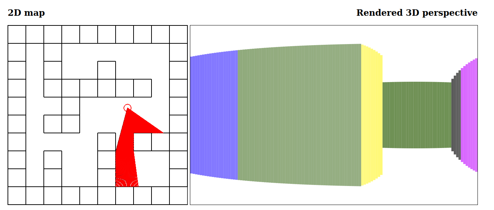

# 2D ray casting in JavaScript
This is a (very simple) JavaScript implementation of 2d ray casting. 2d ray casting has been used in older games, such as Wolfenstein 3D, to render a 3d world based on a 2d map.



# Controls
- Arrow up: move forward
- Arrow down: move backward
- Arrow left: turn to the left
- Arrow right: turn to the right

# Adjustments
Some attributes can be adjusted very easily. 

### Change amount rays
Change ```nrays``` when creating a player object. See ```player.js```.

### Change field of view (FOV)
Change ```fov``` when creating a player object. See ```player.js```. Note that FOV is in degrees.

### Change the amount of pixels the player moves
Change ```speed``` when creating a player object. See ```player.js```. This attribute is measured in pixels.

### Change how many degrees the camera should shift
Change ```turnRate``` when creating a player object. See ```player.js```. Note that FOV is in degrees.

### Change game size
Adding more cells while keeping the length and width of the canvas, change ```cellWidth``` or ```cellHeight``` when creating a game object in ```game.js```. Both attributes are measured in pixels. In the function ```createWalls()```, the 2d map can be altered. 
