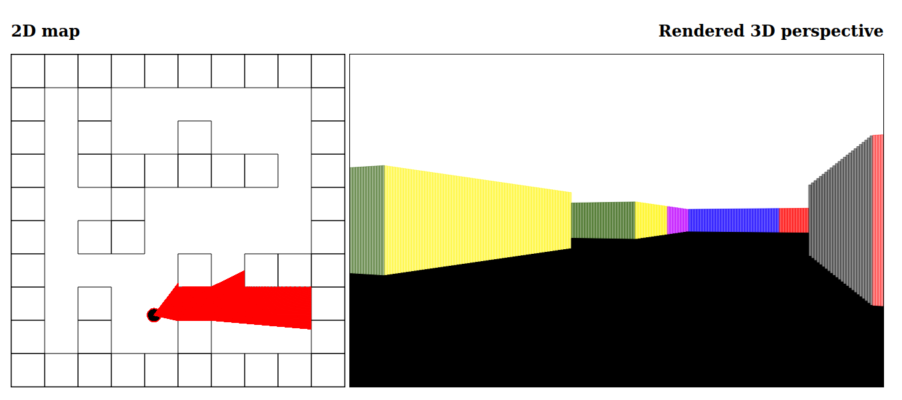

# 2D ray casting in JavaScript
This is a (very basic) JavaScript implementation of 2d ray casting. Just a fun project to learn about ray casting. 2d ray casting has been used in older games, such as Wolfenstein 3D, to render a 3d world based on a 2d map.



# Controls
- Arrow up: move forward
- Arrow down: move backward
- Arrow left: turn to the left
- Arrow right: turn to the right

# Customizable
- Change the map layout in ```map.js```
- Change the field of view of the player in ```player.js```
- Change the turn rate of the player in ```player.js```
- Change the movement speed of the player in ```player.js```
- Change the number of rays in ```player.js```
